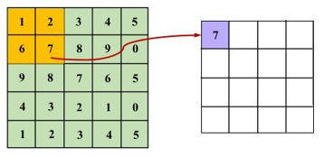

## CNN卷积神经网络

### CNN的模型结构

可以看到，CNN通常包括这几层：输入层（input layer）、卷积层（convolutional layer）、池化层（pooling layer）以及输出层（全连接层+softmax layer）。

### 卷积层

[一个视频20分钟讲透：卷积底层数学逻辑是什么？为什么要卷？不卷行不行？它竟然和傅里叶变换拉普拉斯变换小波变换同宗同源？计算实例，应用演示！_哔哩哔哩_bilibili](https://www.bilibili.com/video/BV16yjdzmE3W/?spm_id_from=333.337.search-card.all.click&vd_source=8536cb876aa29ebdb0cd5626bc423c0f)

卷积层是**卷积神经网络**的核心基石。在[图像识别](https://cloud.tencent.com/product/imagerecognition?from_column=20065&from=20065)里我们提到的卷积是二维卷积，即卷积核与二维图像做卷积操作，简单讲是卷积核滑动到二维图像上所有位置，并在每个位置上与该像素点及其领域像素点做内积，就如上图所示。不同卷积核可以提取不同的特征 ，在深层卷积神经网络中，通过卷积操作可以提取出图像低级到复杂的特征。

  要注意的是，层与层之间会有若干个卷积核（上图只是一个），同时，卷积核深度与初始图片的通道数一致，如下图所示（中间卷积核深度为3）：

### 全连接网络与CNN

顾名思义，全连接网络当前层的每一个神经元与下一层的每个神经元都进行了连接，如下所示：

而CNN相比于全连接网络，有以下两点不同：1、至少一个卷积层；2、局部连接和权值共享。

#### 局部连接

局部连接，顾名思义，不是全连接。每个神经元仅与输入神经元的一块区域连接，这块局部区域称作感受野。对于二维图像本身而言，局部像素关联较强。这种局部连接保证了学习后的过滤器能够对于局部的输入特征有最强的响应。

  比如说，输入图像为1000 * 1000大小，即输入层有1000 * 1000=  维，若隐含层与输入层的数目一样，也有  个，则输入层到隐含层的全连接参数个数为  ，数目非常之大，基本很难训练。

  假如每个神经元只和10 * 10个像素值相连，那么权值数据为  个参数，减少为原来的千分之一。而那10 * 10个像素值对应的10 * 10个参数，其实就相当于卷积操作。

#### 权值共享

通过局部连接处理后，神经元之间的连接个数已经有所减少。可是实际上并没有减少很多，参数数量还是很大。而权值共享就是来解决这个问题的，它能显著降低参数的数量。

  所谓权值共享，**指的是计算同一个深度切片的神经元时采用的卷积核是共享的。请注意权重只是对于同一深度切片的神经元是共享的，在卷积层，通常采用多组卷积核提取不同特征，即对应不同深度切片的特征，不同深度切片的神经元权重是不共享。**

   例如在上面的局部连接中，每个神经元都对应100个参数，一共  个神经元，如果这  个神经元的100个参数都是相等的，那么参数数目就变为100了。由此可见，权值共享可以大大减少网络的参数。

### **池化**

一般来说，每一个卷积层后面都会加一个池化层。池化层（Pooling Layer）也叫子采样层（Subsampling Layer）， 其作用是进行特征选择， 降低特征数量， 从而减少参数数量。通常使用的池化操作为平均池化和最大值池化。

#### 最大池化

对于一个区域，选择这个区域内所有神经元的最大活性值作为这个区域的池化结果，如下所示：

#### 平均池化

对于一个区域，选择这个区域内所有神经元平均活性值作为这个区域的表示，对于上图来说，池化结果为4。

  需要指出的是，池化层没有需要学习的参数，使用时仅需指定池化类型(average 或 max 等)、池化操作的核大小( kernel size )和池化操作的步长（stride）等超参数即可。

### 输出层

输出层通常为一个全连接层和一个softmax layer。

#### 全连接层

全连接层在整个卷积神经网络中起到“分类器”的作用。即通过卷积、激活函数、池化等深度网络后，再经过全连接层对结果进行识别分类。

  在实际使用中，全连接层可由**卷积操作**实现：对前一层是全连接的全连接层，可以转化为卷积核为 1 × 1 的卷积（即保持不变）；而前层是卷积层的全连接层可以转化为卷积核为h × w的全局卷积，h 和 w 分别为前层卷积输出结果的高和宽，这样我们就可以确定全连接层的神经元个数了。

#### softmax layer

最终我们是要分类，假设需要分为三类：

分为三类，则softmax layer层有三个神经元，前面全连接层计算传播到softmax layer后有三个值，假设为3，1，-1，则softmax layer要做的操作如下所示：

对三个数分别求e的指数，然后再求出三者占指数和的比例，比例大的即为预测结果。
