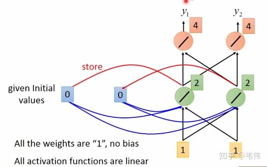

## CNN卷积神经网络

### CNN的模型结构

可以看到，CNN通常包括这几层：输入层（input layer）、卷积层（convolutional layer）、池化层（pooling layer）以及输出层（全连接层+softmax layer）。

### 卷积层

[一个视频20分钟讲透：卷积底层数学逻辑是什么？为什么要卷？不卷行不行？它竟然和傅里叶变换拉普拉斯变换小波变换同宗同源？计算实例，应用演示！_哔哩哔哩_bilibili](https://www.bilibili.com/video/BV16yjdzmE3W/?spm_id_from=333.337.search-card.all.click&vd_source=8536cb876aa29ebdb0cd5626bc423c0f)

卷积层是**卷积神经网络**的核心基石。在[图像识别](https://cloud.tencent.com/product/imagerecognition?from_column=20065&from=20065)里我们提到的卷积是二维卷积，即卷积核与二维图像做卷积操作，简单讲是卷积核滑动到二维图像上所有位置，并在每个位置上与该像素点及其领域像素点做内积，就如上图所示。不同卷积核可以提取不同的特征 ，在深层卷积神经网络中，通过卷积操作可以提取出图像低级到复杂的特征。

  要注意的是，层与层之间会有若干个卷积核（上图只是一个），同时，卷积核深度与初始图片的通道数一致，如下图所示（中间卷积核深度为3）：

### 全连接网络与CNN

顾名思义，全连接网络当前层的每一个神经元与下一层的每个神经元都进行了连接，如下所示：

而CNN相比于全连接网络，有以下两点不同：1、至少一个卷积层；2、局部连接和权值共享。

#### 局部连接

局部连接，顾名思义，不是全连接。每个神经元仅与输入神经元的一块区域连接，这块局部区域称作感受野。对于二维图像本身而言，局部像素关联较强。这种局部连接保证了学习后的过滤器能够对于局部的输入特征有最强的响应。

  比如说，输入图像为1000 * 1000大小，即输入层有1000 * 1000=  维，若隐含层与输入层的数目一样，也有  个，则输入层到隐含层的全连接参数个数为  ，数目非常之大，基本很难训练。

  假如每个神经元只和10 * 10个像素值相连，那么权值数据为  个参数，减少为原来的千分之一。而那10 * 10个像素值对应的10 * 10个参数，其实就相当于卷积操作。

#### 权值共享

通过局部连接处理后，神经元之间的连接个数已经有所减少。可是实际上并没有减少很多，参数数量还是很大。而权值共享就是来解决这个问题的，它能显著降低参数的数量。

  所谓权值共享，**指的是计算同一个深度切片的神经元时采用的卷积核是共享的。请注意权重只是对于同一深度切片的神经元是共享的，在卷积层，通常采用多组卷积核提取不同特征，即对应不同深度切片的特征，不同深度切片的神经元权重是不共享。**

   例如在上面的局部连接中，每个神经元都对应100个参数，一共  个神经元，如果这  个神经元的100个参数都是相等的，那么参数数目就变为100了。由此可见，权值共享可以大大减少网络的参数。

### **池化**

一般来说，每一个卷积层后面都会加一个池化层。池化层（Pooling Layer）也叫子采样层（Subsampling Layer）， 其作用是进行特征选择， 降低特征数量， 从而减少参数数量。通常使用的池化操作为平均池化和最大值池化。

#### 最大池化

对于一个区域，选择这个区域内所有神经元的最大活性值作为这个区域的池化结果，如下所示：

#### 平均池化

对于一个区域，选择这个区域内所有神经元平均活性值作为这个区域的表示，对于上图来说，池化结果为4。

  需要指出的是，池化层没有需要学习的参数，使用时仅需指定池化类型(average 或 max 等)、池化操作的核大小( kernel size )和池化操作的步长（stride）等超参数即可。

### 输出层

输出层通常为一个全连接层和一个softmax layer。

#### 全连接层

全连接层在整个卷积神经网络中起到“分类器”的作用。即通过卷积、激活函数、池化等深度网络后，再经过全连接层对结果进行识别分类。

  在实际使用中，全连接层可由**卷积操作**实现：对前一层是全连接的全连接层，可以转化为卷积核为 1 × 1 的卷积（即保持不变）；而前层是卷积层的全连接层可以转化为卷积核为h × w的全局卷积，h 和 w 分别为前层卷积输出结果的高和宽，这样我们就可以确定全连接层的神经元个数了。

#### softmax layer

最终我们是要分类，假设需要分为三类：

分为三类，则softmax layer层有三个神经元，前面全连接层计算传播到softmax layer后有三个值，假设为3，1，-1，则softmax layer要做的操作如下所示：

对三个数分别求e的指数，然后再求出三者占指数和的比例，比例大的即为预测结果。

## RNN循环神经网络

**RNN对具有序列特性的数据非常有效，它能挖掘数据中的时序信息以及语义信息，** 利用了RNN的这种能力，使深度学习模型在解决语音识别、语言模型、机器翻译以及时序分析等NLP领域的问题时有所突破。

RNN用于处理序列数据。在传统的神经网络模型中，是从输入层到隐含层再到输出层，层与层之间是全连接的，每层之间的节点是无连接的。但是这种普通的神经网络对于很多问题却无能无力。例如，你要预测句子的下一个单词是什么，一般需要用到前面的单词，因为一个句子中前后单词并不是独立的。RNN之所以称为循环神经网路，即一个序列当前的输出与前面的输出也有关。具体的表现形式为网络会对前面的信息进行记忆并应用于当前输出的计算中，即隐藏层之间的节点不再无连接而是有连接的，并且隐藏层的输入不仅包括输入层的输出还包括上一时刻隐藏层的输出。理论上，RNN能够对任何长度的序列数据进行处理。但是在实践中，为了降低复杂性往往假设当前的状态只与前面的几个状态相关。（RNN每一步的参数共享）

### RNN多结构详解

这就是最经典的RNN结构，它的输入是x1, x2, …..xn，输出为y1, y2, …yn，也就是说，输入和输出序列必须要是等长的。由于这个限制的存在，经典RNN的适用范围比较小，但也有一些问题适合用经典的RNN结构建模，如：

计算视频中每一帧的分类标签。因为要对每一帧进行计算，因此输入和输出序列等长。
输入为字符，输出为下一个字符的概率。这就是著名的Char RNN（详细介绍请参考http://karpathy.github.io/2015/05/21/rnn-effectiveness/，Char RNN可以用来生成文章，诗歌，甚至是代码，非常有意思）。

I love you，那么在利用RNN做一些事情时，比如命名实体识别，上图中的  代表的就是I这个单词的向量，  代表的是love这个单词的向量，  代表的是you这个单词的向量，以此类推，我们注意到，上图展开后，W一直没有变， **W其实是每个时间点之间的权重矩阵** ，我们注意到，RNN之所以可以解决序列问题， **是因为它可以记住每一时刻的信息，每一时刻的隐藏层不仅由该时刻的输入层决定，还由上一时刻的隐藏层决定** ，公式如下，其中  代表t时刻的输出,  代表t时刻的隐藏层的值：

**值得注意的一点是，在整个训练过程中，每一时刻所用的都是同样的W。**

### 举例说明

### LSTM

Long short-term memory，翻译过来就是长短期记忆

#### 结构

1. Input Gate：中文是输入门，在每一时刻从输入层输入的信息会首先经过输入门，输入门的开关会决定这一时刻是否会有信息输入到Memory Cell。
2. Output Gate：中文是输出门，每一时刻是否有信息从Memory Cell输出取决于这一道门。
3. Forget Gate：中文是遗忘门，每一时刻Memory Cell里的值都会经历一个是否被遗忘的过程，就是由该门控制的，如果打卡，那么将会把Memory Cell里的值清除，也就是遗忘掉。

## Transformer

[《Attention is all you need》论文解读及Transformer架构详细介绍](https://www.bilibili.com/video/BV1xoJwzDESD/?spm_id_from=333.1391.top_right_bar_window_default_collection.content.click&vd_source=6d432ace2403224c4a22058ab8af89cc)

整体结构

可以看到  **Transformer 由 Encoder 和 Decoder 两个部分组成** ，Encoder 和 Decoder 都包含 6 个 block。Transformer 的工作流程大体如下：

**第一步：** 获取输入句子的每一个单词的表示向量  **X** ，**X**由单词的 Embedding（Embedding就是从原始数据提取出来的Feature） 和单词位置的 Embedding 相加得到。

**第二步：** 将得到的单词表示向量矩阵 (如上图所示，每一行是一个单词的表示  **x** ) 传入 Encoder 中，经过 6 个 Encoder block 后可以得到句子所有单词的编码信息矩阵 **C
**

 **第三步** ：将 Encoder 输出的编码信息矩阵 **C**传递到 Decoder 中，Decoder 依次会根据当前翻译过的单词 1~ i 翻译下一个单词 i+1，如下图所示。在使用的过程中，翻译到单词 i+1 的时候需要通过 **Mask (掩盖)** 操作遮盖住 i+1 之后的单词。

上图 Decoder 接收了 Encoder 的编码矩阵 ** C** ，然后首先输入一个翻译开始符 "`<Begin>`"，预测第一个单词 "I"；然后输入翻译开始符 "`<Begin>`" 和单词 "I"，预测单词 "have"，以此类推。这是 Transformer 使用时候的大致流程，接下来是里面各个部分的细节。

### Transformer的输入

Transformer 中单词的输入表示 **x**由**单词 Embedding** 和**位置 Embedding** （Positional Encoding）相加得到。

#### 单词Embedding

单词的 Embedding 有很多种方式可以获取，例如可以采用 Word2Vec、Glove 等算法预训练得到，也可以在 Transformer 中训练得到。

#### 位置Embedding

Transformer 中除了单词的 Embedding，还需要使用位置 Embedding 表示单词出现在句子中的位置。 **因为 Transformer 不采用 RNN 的结构，而是使用全局信息，不能利用单词的顺序信息，而这部分信息对于 NLP 来说非常重要。** 所以 Transformer 中使用位置 Embedding 保存单词在序列中的相对或绝对位置。

位置 Embedding 用 **PE**表示，**PE** 的维度与单词 Embedding 是一样的。PE 可以通过训练得到，也可以使用某种公式计算得到。在 Transformer 中采用了后者，计算公式如下：

其中，pos 表示单词在句子中的位置，d 表示 PE的维度 (与词 Embedding 一样)，2i 表示偶数的维度，2i+1 表示奇数维度 (即 2i≤d, 2i+1≤d)。使用这种公式计算 PE 有以下的好处：

* 使 PE 能够适应比训练集里面所有句子更长的句子，假设训练集里面最长的句子是有 20 个单词，突然来了一个长度为 21 的句子，则使用公式计算的方法可以计算出第 21 位的 Embedding。
* 可以让模型容易地计算出相对位置，对于固定长度的间距 k，**PE(pos+k)** 可以用 **PE(pos)** 计算得到。因为 Sin(A+B) = Sin(A)Cos(B) + Cos(A)Sin(B), Cos(A+B) = Cos(A)Cos(B) - Sin(A)Sin(B)。

将单词的词 Embedding 和位置 Embedding 相加，就可以得到单词的表示向量  **x** ，**x **就是 Transformer 的输入。

### Self-attention(自注意力机制)

上图是论文中 Transformer 的内部结构图，左侧为 Encoder block，右侧为 Decoder block。红色圈中的部分为 ** Multi-Head Attention** ，是由多个 **Self-Attention**组成的，可以看到 Encoder block 包含一个 Multi-Head Attention，而 Decoder block 包含两个 Multi-Head Attention (其中有一个用到 Masked)。Multi-Head Attention 上方还包括一个 Add & Norm 层，Add 表示残差连接 (Residual Connection) 用于防止网络退化，Norm 表示 Layer Normalization，用于对每一层的激活值进行归一化。

因为 **Self-Attention**是 Transformer 的重点，所以我们重点关注 Multi-Head Attention 以及 Self-Attention，首先详细了解一下 Self-Attention 的内部逻辑。

#### Self-attention的结构

上图是 Self-Attention 的结构，在计算的时候需要用到矩阵 **Q(查询),K(键值),V(值)** 。在实际中，Self-Attention 接收的是输入(单词的表示向量x组成的矩阵X) 或者上一个 Encoder block 的输出。而**Q,K,V**正是通过 Self-Attention 的输入进行线性变换得到的

#### Q K V 的计算

Self-Attention 的输入用矩阵X进行表示，则可以使用线性变阵矩阵**WQ,WK,WV**计算得到 **Q,K,V** 。计算如下图所示，**注意 X, Q, K, V 的每一行都表示一个单词。**

#### Self-attention的输出

得到矩阵 Q, K, V之后就可以计算出 Self-Attention 的输出了，计算的公式如下：

使用 Softmax 计算每一个单词对于其他单词的 attention 系数，公式中的 Softmax 是对矩阵的每一行进行 Softmax，即每一行的和都变为 1.

#### Multi-Head Attention

### Encoder结构

上图红色部分是 Transformer 的 Encoder block 结构，可以看到是由 Multi-Head Attention,$  Add & Norm, Feed Forward, Add & Norm  $组成的。刚刚已经了解了 Multi-Head Attention 的计算过程，现在了解一下 Add & Norm 和 Feed Forward 部分。

#### Add & Norm

其中 **X**表示 Multi-Head Attention 或者 Feed Forward 的输入，MultiHeadAttention( **X** ) 和 FeedForward( **X** ) 表示输出 (输出与输入$ X $维度是一样的，所以可以相加)。

**Add**指  **X** +MultiHeadAttention( **X** )，是一种残差连接，通常用于解决多层网络训练的问题，可以让网络只关注当前差异的部分，在 ResNet 中经常用到：

#### Feed Forward

Feed Forward 层比较简单，是一个两层的全连接层，第一层的激活函数为 Relu，第二层不使用激活函数，对应的公式如下。

**X**是输入，Feed Forward 最终得到的输出矩阵的维度与**X**一致。
