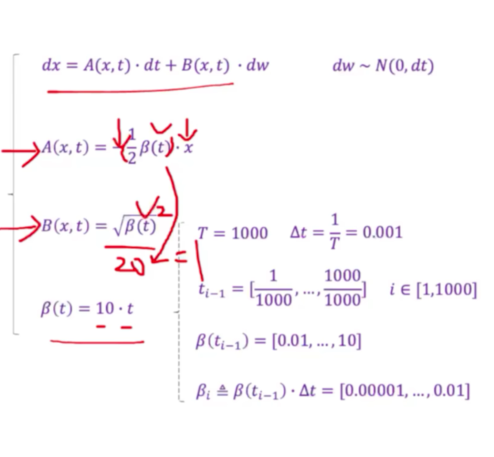
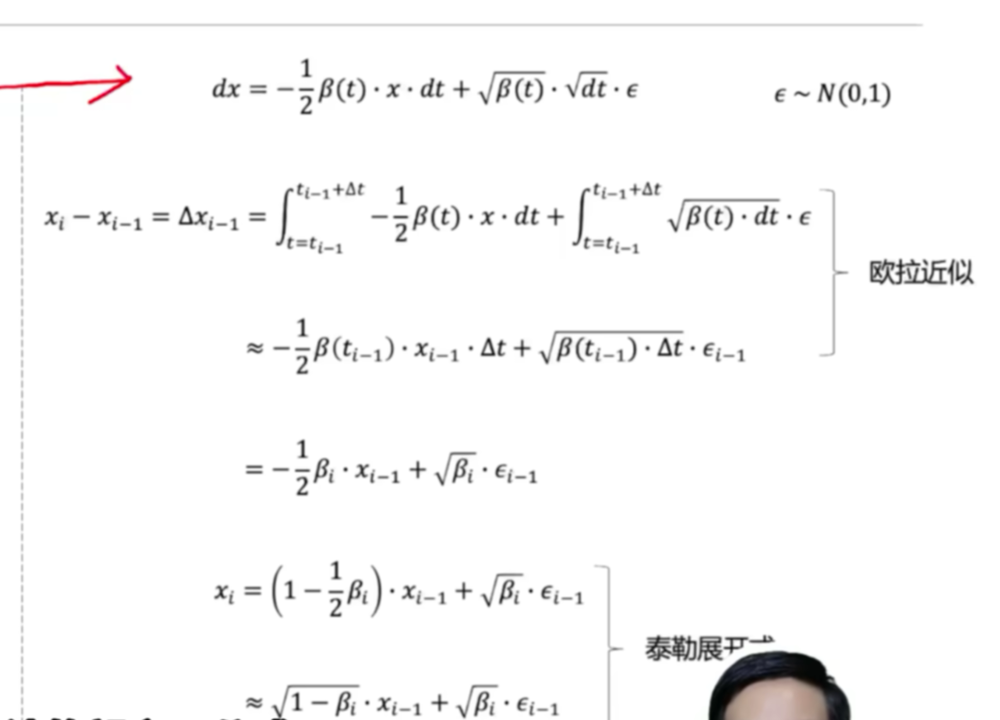
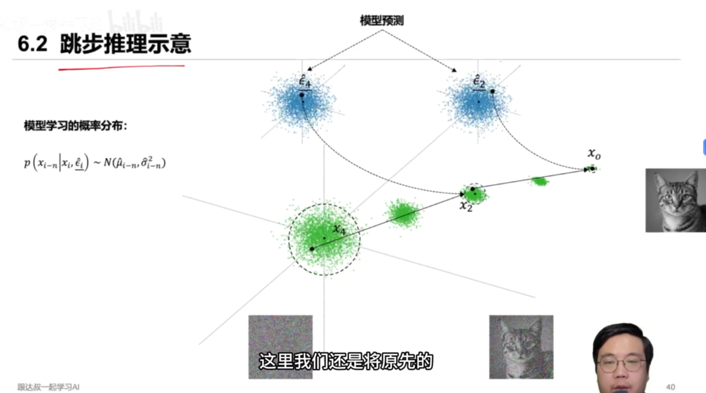

## 热力学基本公式

[第1章：扩散模型理论基础_哔哩哔哩_bilibili](https://www.bilibili.com/video/BV1fmHpzNE9s/?spm_id_from=333.1391.0.0&vd_source=8536cb876aa29ebdb0cd5626bc423c0f)

### 1908 郎之万动力方程（SDE）

### 高斯分布

高斯分布的线性转化（重参数化）

## 使用非平衡热力学的深度无监督学习

### 前向单步加噪声过程

### 前向累计加噪过程

### 反向单步去噪

## DDPM(去噪扩散概率模型)

[扩散模型的原理是什么？扩散模型原理及代码实现，为什么可以用它生成图片、视频、音乐等内容？Diffusion Model，3小时快速上手！（附带源码）_哔哩哔哩_bilibili](https://www.bilibili.com/video/BV1F54qzXE7J?spm_id_from=333.788.recommend_more_video.-1&trackid=web_related_0.router-related-2206419-tqkgg.1761378272465.118&vd_source=8536cb876aa29ebdb0cd5626bc423c0f)

### Jensen 不等式

[快速学会&#34;琴生不等式&#34;!_哔哩哔哩_bilibili](https://www.bilibili.com/video/BV1wx4y1L78Q/?spm_id_from=333.337.search-card.all.click&vd_source=8536cb876aa29ebdb0cd5626bc423c0f)

### 最大似然估计

[什么是最大似然估计，及其对损失函数的推导过程_哔哩哔哩_bilibili](https://www.bilibili.com/video/BV1JAgDzSEWj/?spm_id_from=333.337.search-card.all.click&vd_source=8536cb876aa29ebdb0cd5626bc423c0f)

## DDIM(去噪扩散隐式模型)

### 跳步推理

### 反向跳步去噪

### 模型推理

### 从随机推理到确定推理

### 调节方程

### 确定推理示意图

## Flow  Matching

