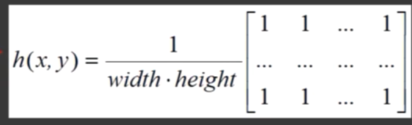
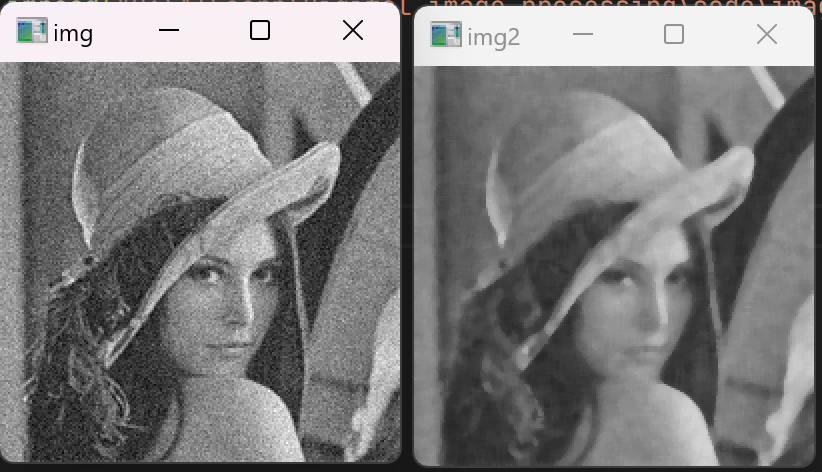
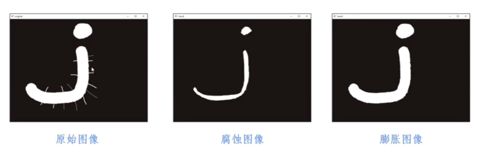
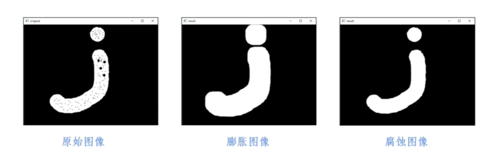
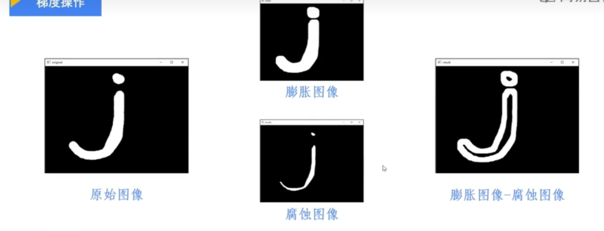
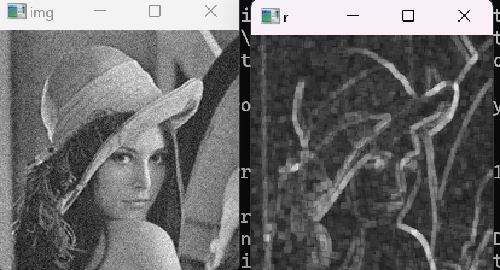
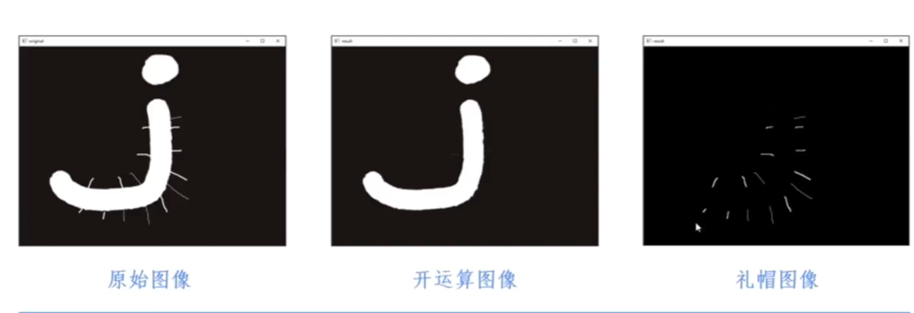
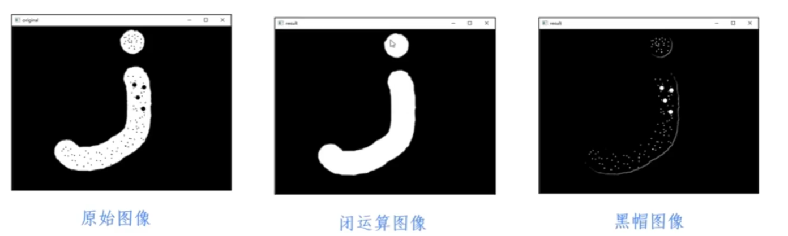
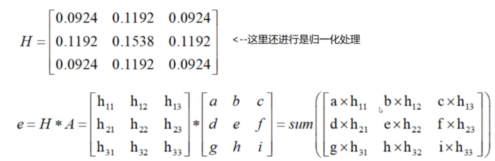
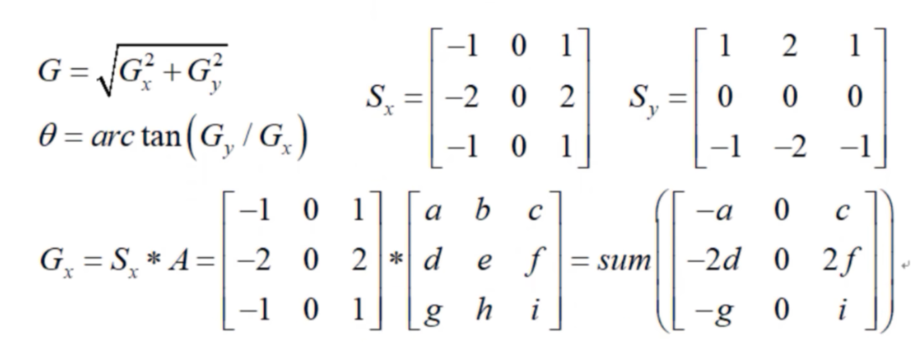

## 卷积滤波

[卷积神经网络中的滤波器要选择多少个呢？！3D动画_哔哩哔哩_bilibili](https://www.bilibili.com/video/BV15T41147Qr?spm_id_from=333.788.videopod.sections&vd_source=8536cb876aa29ebdb0cd5626bc423c0f)

### 线性滤波 

#### 一维线性滤波

1.一维 二维

2.线性 非线性

3.卷积运算： 卷积核尺寸 卷积核系数

#### 二维线性滤波

1.均值滤波

2.高斯滤波

3.中值滤波

非线性滤波

### 形态学滤波

## 形态学转换

### 图像腐蚀

### 图像膨胀

### 图像开运算

先腐蚀->再膨胀

去除外部毛刺

### 图像闭运算

先膨胀->再腐蚀

去除内部黑点

### 图像梯度

获得轮廓图像

开运算图像-闭运算图像

### 图像礼帽

捕获毛刺

原始图像 -  开运算图像 

### 图像黑帽

捕获噪点

原始图像-闭运算图像

## Canny边缘检测算法

1.高斯滤波器 以平滑图像 滤除噪声

2.计算图像中每个像素点的梯度强度和方向

3.应用非极大值抑制以消除边缘检测带来的杂散响应

4.应用双阈值检测来确定真实的和潜在的边缘

5.通过抑制孤立边缘最终完成边缘检测

### 高斯滤波器

### 梯度和方向

