## 卷积滤波

[卷积神经网络中的滤波器要选择多少个呢？！3D动画_哔哩哔哩_bilibili](https://www.bilibili.com/video/BV15T41147Qr?spm_id_from=333.788.videopod.sections&vd_source=8536cb876aa29ebdb0cd5626bc423c0f)

### 线性滤波

#### 一维线性滤波

1.一维 二维

2.线性 非线性

3.卷积运算： 卷积核尺寸 卷积核系数

#### 二维线性滤波

1.均值滤波

2.高斯滤波

3.中值滤波

非线性滤波

### 形态学滤波

## 形态学转换

### 图像腐蚀

### 图像膨胀

### 图像开运算

先腐蚀->再膨胀

去除外部毛刺

### 图像闭运算

先膨胀->再腐蚀

去除内部黑点

### 图像梯度

获得轮廓图像

开运算图像-闭运算图像

### 图像礼帽

捕获毛刺

原始图像 -  开运算图像

### 图像黑帽

捕获噪点

原始图像-闭运算图像

## 图像梯度

### sobel算子和scharr算子

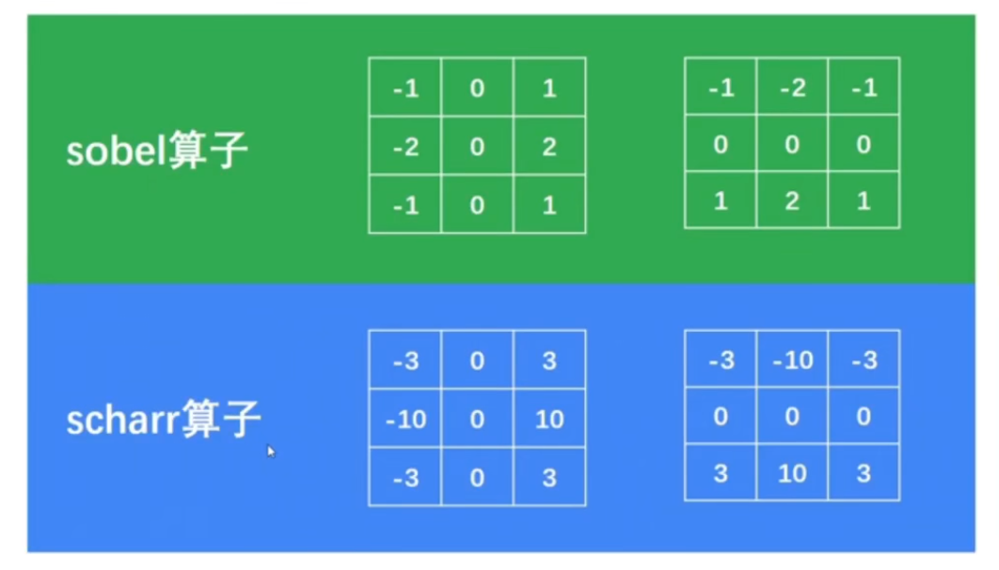

### Laplacian算子

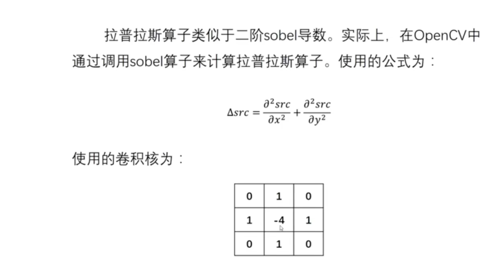

## Canny边缘检测算法

1.高斯滤波器 以平滑图像 滤除噪声

2.计算图像中每个像素点的梯度强度和方向

3.应用非极大值抑制以消除边缘检测带来的杂散响应

4.应用双阈值检测来确定真实的和潜在的边缘

5.通过抑制孤立边缘最终完成边缘检测

### 高斯滤波器

### 梯度和方向

计算值和方向

### 非极大值抑制

在获得了梯度和方向之后，遍历图像，去除所有不是边界的点

实现方法：逐个遍历像素点，判断当前像素点是否是周围像素点中具有相同方向梯度的最大值

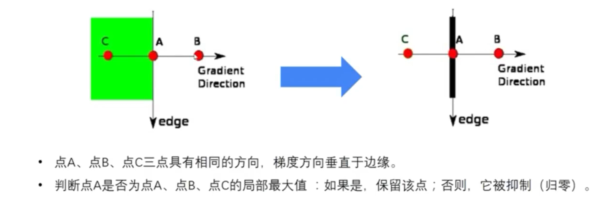

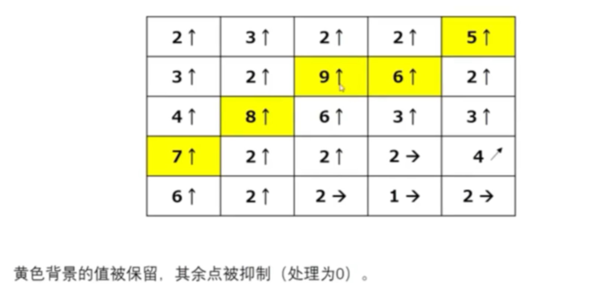

### 滞后阈值

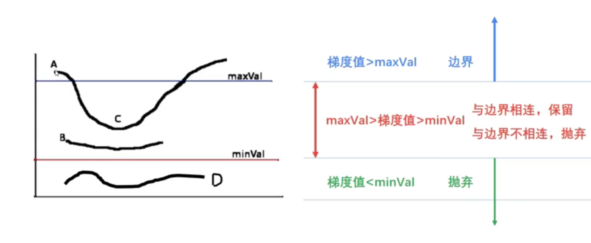

## 图像金字塔

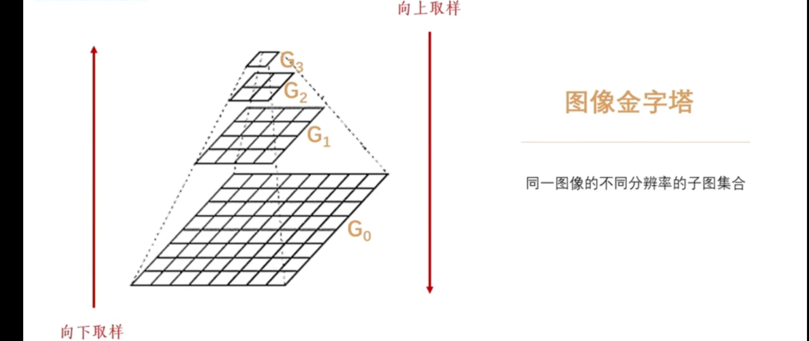

### 向下取样

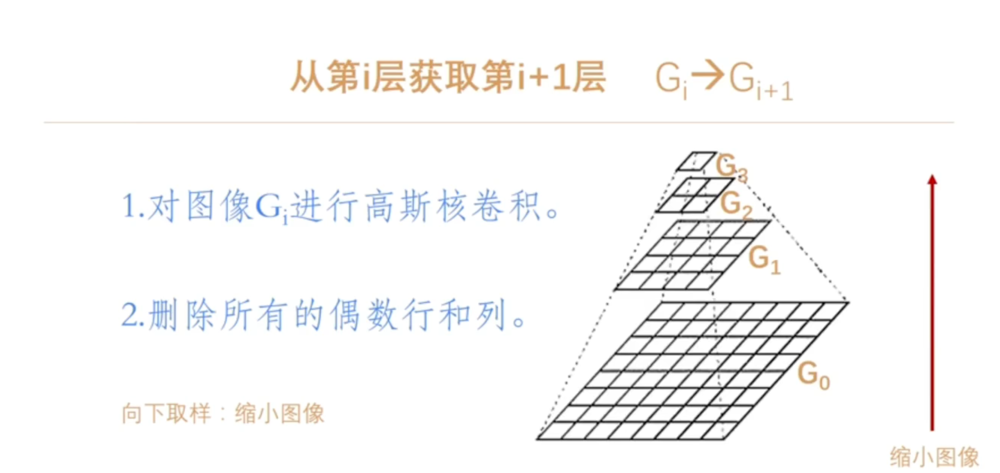

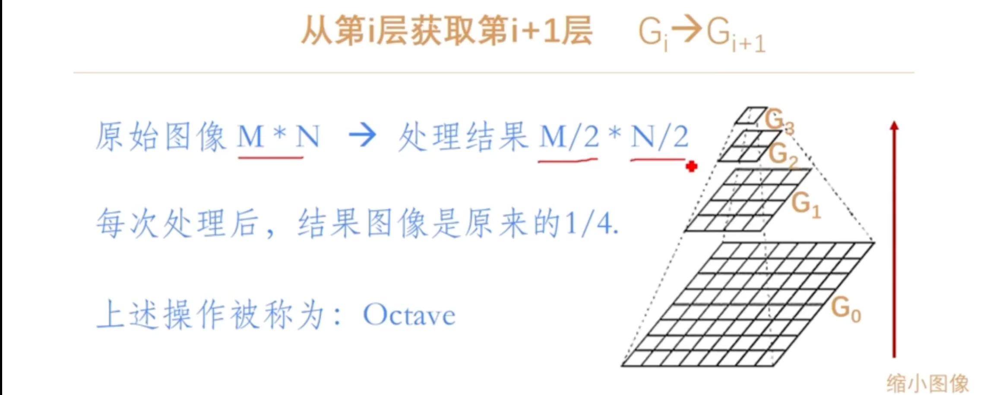

### 向上取样

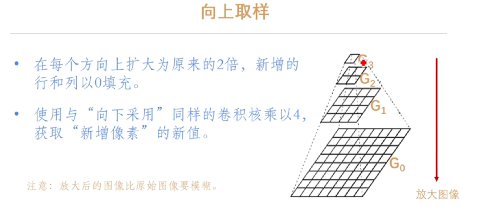

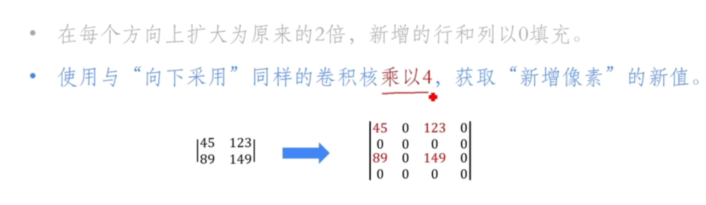

## 傅里叶变换

[B站首发！草履虫都能看懂的【傅里叶变换】讲解，清华大学李永乐老师教你如何理解傅里叶变换，辨清美颜和变声原理，！！_哔哩哔哩_bilibili](https://www.bilibili.com/video/BV1aW4y1y7Hs/?spm_id_from=333.337.search-card.all.click&vd_source=8536cb876aa29ebdb0cd5626bc423c0f)

## JEPG图像压缩

### 离散余弦变换

离散余弦变换（Discrete Cosine Transform，DCT）是一种 **将信号从「空间域」转换到「频率域」的数学工具** 。

* 空间域：我们看到的图像原始数据（比如 JPEG 中 8×8 像素块），每个像素是一个独立的亮度 / 色度值（0-255），信号是「像素点的数值分布」；
* 频率域：转换后得到的是「不同频率的余弦波分量」—— 可以理解为： **任何图像块都能拆成多个 “明暗变化快慢不同” 的余弦波叠加而成** 。

  * 低频分量：明暗变化慢（比如一张人脸的额头区域，像素值差异小），决定图像的 “整体轮廓”；
  * 高频分量：明暗变化快（比如人脸的眉毛、眼睛边缘，像素值突变），决定图像的 “细节”

  #### 数学本质（简化版，不用死记）

  对于 JPEG 中常用的 8×8 二维 DCT，公式核心是：将 8×8 的像素矩阵 **\(f(x,y)\)** 转换为 8×8 的频率系数矩阵 **\(F(u,v)\)**，其中：

  * **\((x,y)\)** 是空间域的像素坐标（0-7）；
  * **\((u,v)\)** 是频率域的系数坐标（0-7），**\(u=0,v=0\)** 对应「直流分量（DC）」（最核心的低频），其余对应「交流分量（AC）」（高频为主）。

  关键特性： **能量集中** —— 图像的绝大部分信息（亮度 / 色度）会集中在低频系数（矩阵左上角），高频系数（右下角）大多接近 0，这是 JPEG 压缩的核心原理。

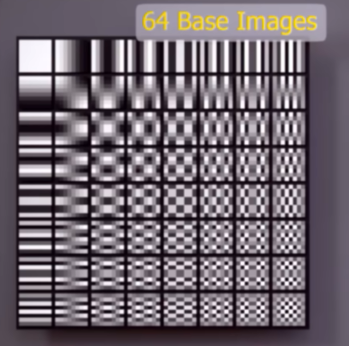

### 量化

#### 亮度量化表

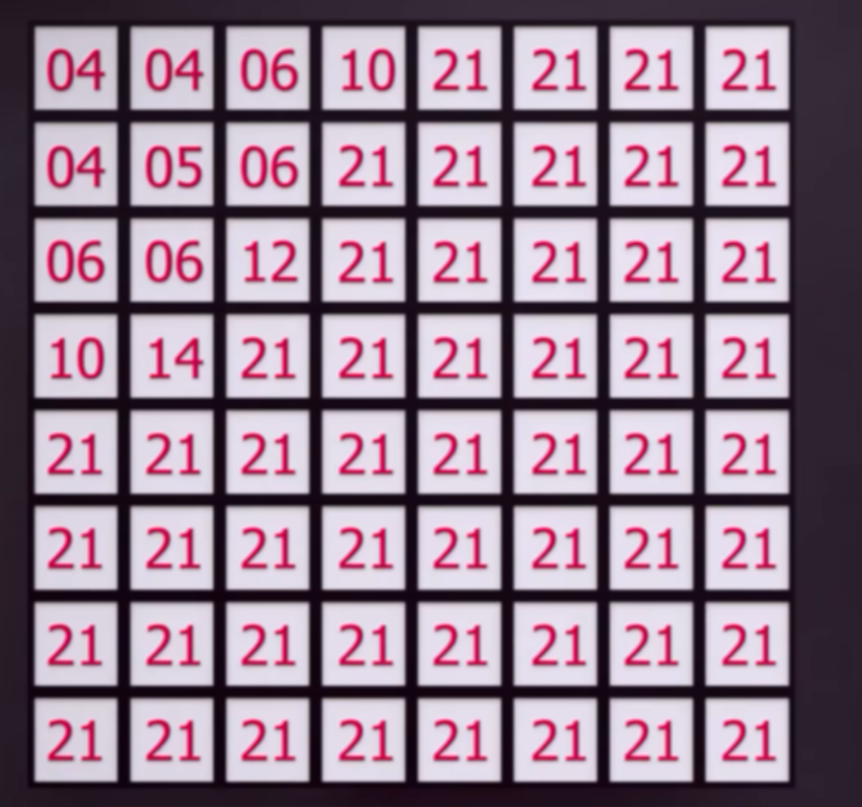

#### 色度量化表

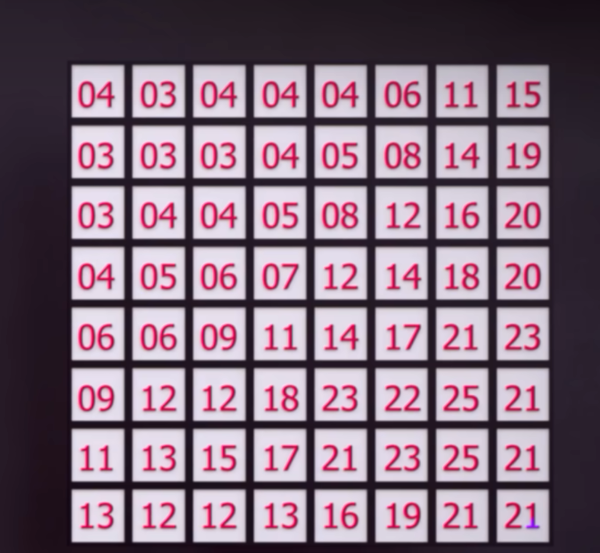

### 编码

#### 游程编码

#### 哈夫曼编码

### 视屏压缩

#### H.246
