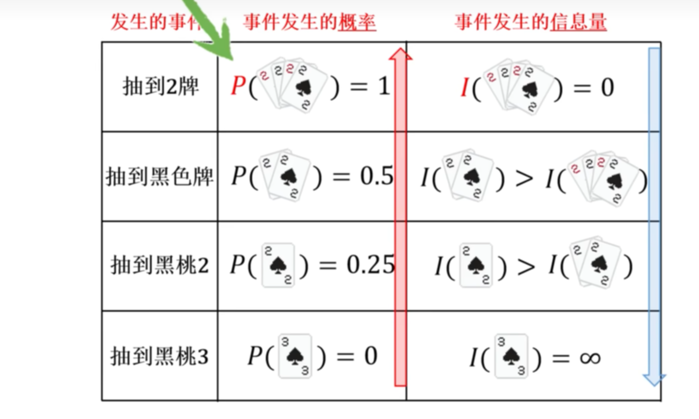
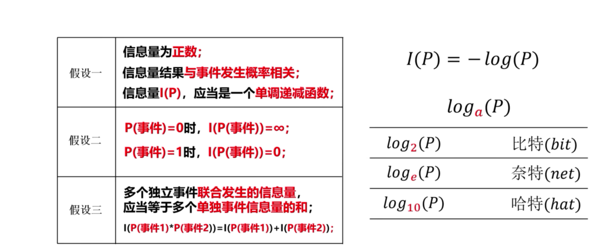
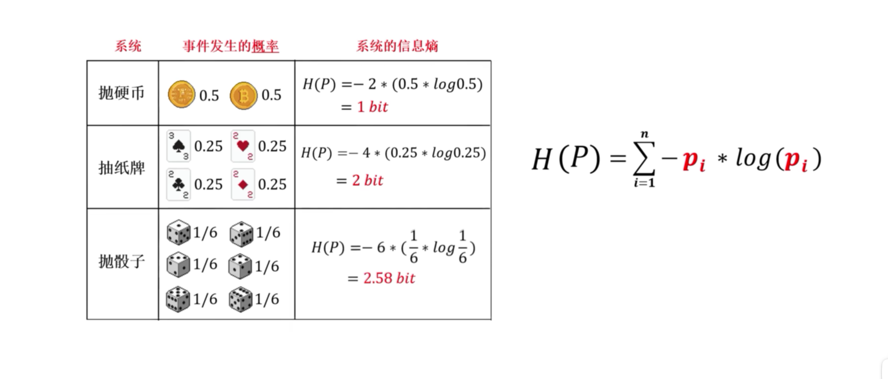
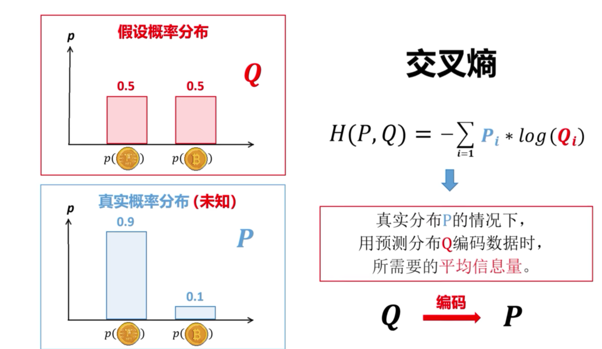
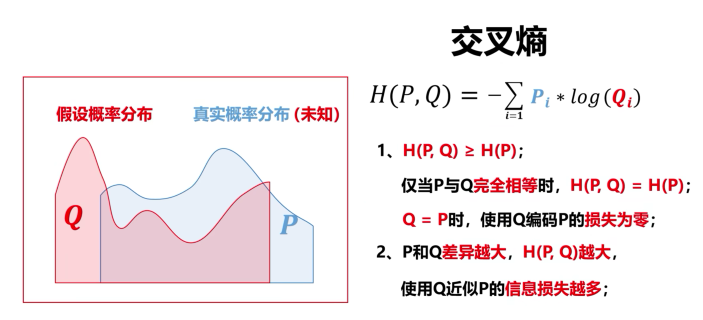
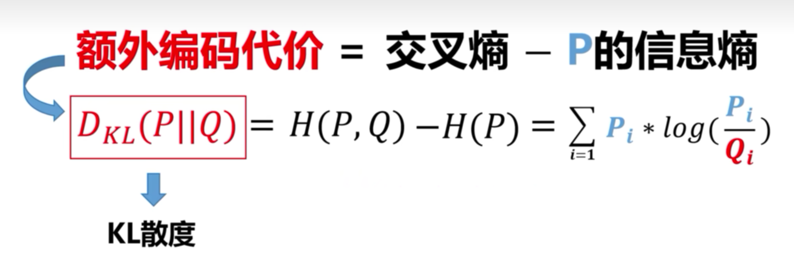
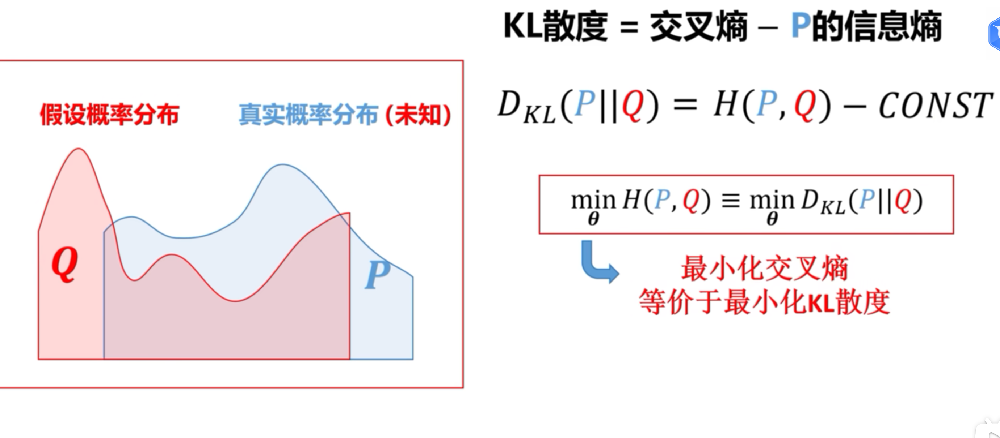

[什么是信息量、信息熵、交叉熵与KL散度，及其相互之间的关系_哔哩哔哩_bilibili](https://www.bilibili.com/video/BV1mkgwzZEN9?spm_id_from=333.788.videopod.sections&vd_source=8536cb876aa29ebdb0cd5626bc423c0f)

## 信息量

1. 一些概念的理解
   首先我们需要将概率、不确定性和信息量这三个概念给串起来。

①一个 事件发生的不确定性与该事件发生的概率有关系。当一个事件发生的概率越高，事件越有可能发生，事件发生的不确定性就越小，反之，概率越低，事件发生的困难程度就越高，事件发生的不确定性也就越高。(概率为1的事件发生的不确定性是0，概率为0的事件发生的不确定性则趋于无穷）
②当信源（产生消息的来源）中某一消息（事件）发生的不确定性越高，一旦它发生，并且被收信者接受，消除的不确定性也就越大，获得的信息也就越多。如果收信者接受到被干扰的消息，对一个消息（事件）发生的不确定性几乎没有消除，则收信者接受到的信息也就微乎其微。因此，获得信息量的大小与不确定性消除的大小有关，我们直观地将信息量定义为
    接受到了某消息（事件发生）所获得的信息量
    =不确定性减少量
    =（收到此消息前关于某事件发生的不确定性)-(收到此消息后关于某事件发生的不确定性）

ps:由于我们是要用概率空间来描述信源，用随机变量来描述信源输出的消息，因此这需要信源可能发出的各种消息（事件）的概率先验可知。

举个例子：
2020年7月25日太阳从东边升起这个事件（必然事件），这件事发生前你知道了这件事情必然会发生（不确定性是0），发生后（不确定性也是0），不确定性减少量是0，因此我们所接受到的信息量是0。

上面几段话的总结：一个事件发生的概率越小，不确定性越大，（因为事件发生了，并且被接收了，事件发生所消除的不确定性就越大了），事件发生所带来的信息量也就越大。（可以看出来信息量与概率成负相关了）

## 信息熵

## 交叉熵

## KL散度

