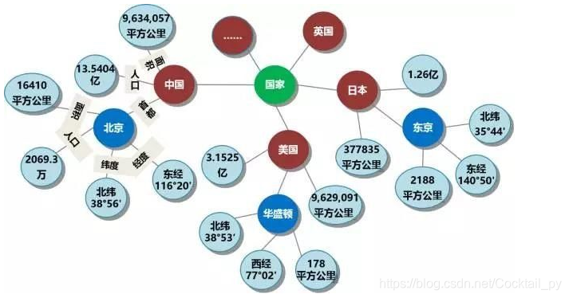
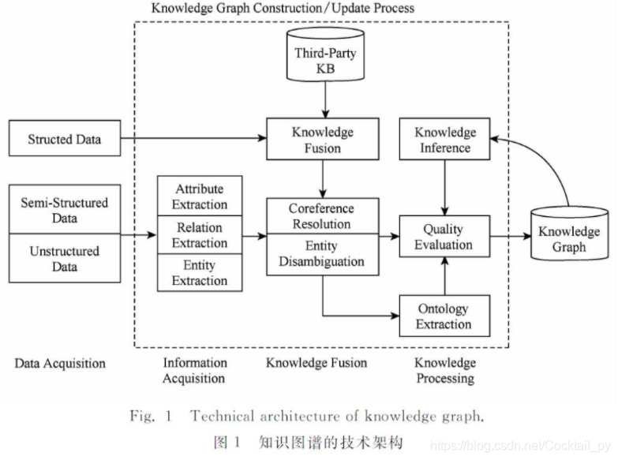
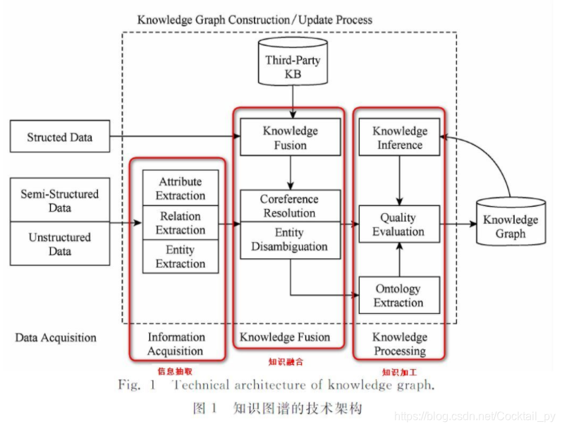
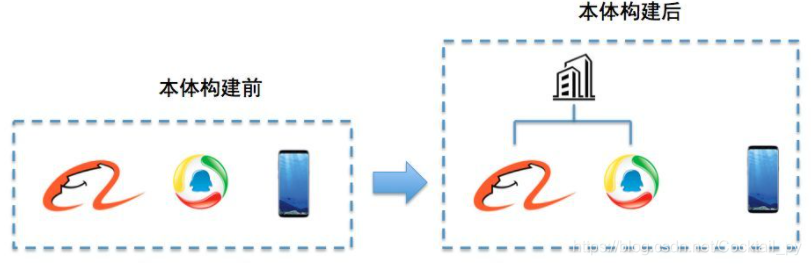
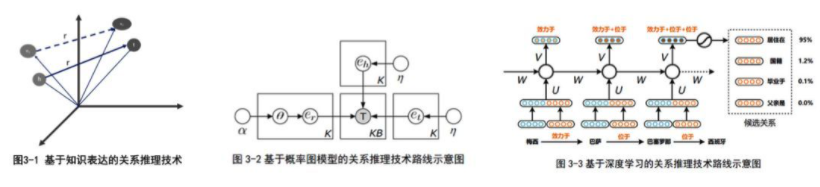

## 知识表示

### 知识表示的分类 

    陈述性知识表示

    过程性知识表示

### 主要知识表示方法

1. 谓词逻辑表示法
2. 语义网络表示法
3. 框架表示法
4. 过程表示法
5. Petri网表示法
6. 面向对象表示法
7. 人工神经元网络（ANN)表示法


### 谓词的阶

* 如果谓词中的所有个体都是常量、变量或函数，那么谓词为一阶谓词
* 如果谓词P中的某个个体本身又是一个一阶谓词，那么P为二阶谓词，以此类推。

### 谓词逻辑表示

1.定义谓词和个体
2. 为变量赋值（个体作为值）
3. 连接词连接谓词，形成谓词公式 

```
#武汉是个美丽的城市，但不是沿海城市。谓词逻辑表示为：
是个美丽的城市(武汉) ∧ ¬是个沿海城市(武汉) 

#机器人站在墙边，手里没有拿东西，桌子上放着积木。谓词逻辑表示为：
在旁边站着(机器人,墙) ∧ 手空着(机器人) ∧ 在上面(积木,桌子)

#机器人拿起积木，谓词表示方法为：
#删除"手空着(机器人)∧在上面(积木,桌子)"，增加"拿着(机器人,积木)"，如下：
在旁边站着(机器人,墙) ∧ 拿着(机器人,积木)

```

### 产生式表示法

确定性规则知识的产生式表示P→Q：IF P THEN Q
P是产生式的前提，Q是一组结论或操作
比如：IF 动物会飞 AND 会下蛋 该动物是鸟 IF 温度高于30度 THEN 关门
产生式可以提供操作，谓词公式不能提供操作


不确定性规则知识的产生式表示 P→Q(可信度)：IF P THEN Q(可信度)
比如：IF 发烧 THEN 感冒(0.6)


确定性事实知识的产生式表示
三元组表示：(对象,属性,值) 或者：(关系,对象1,对象2)
比如：(老李,年龄,40)
比如：(朋友,老王,老李)

不确定性事实知识的产生式表示
“四元组表示：（对象,属性,值,置信度）” 或者：(关系,对象1,对象2,置信度)
比如：(老李,年龄,40,0.8) (朋友,老王,老李,0.1)

```
巴克斯BNF范式：

<产生式>::=<前提> <结论>
        ::=表示定义为 
        空格分开表示顺序执行 
        |表示或者是 
        []表示可选 
  
<前提>::=<简单条件>|<复合条件> 

<复合条件>::=<简单条件>AND<简单条件>[AND...]
            |<简单条件>OR<简单条件>[OR...] 

<结论>::=<事实>|<操作>

<操作>:=<操作名>[(<变量>,...)]

```

## 知识图谱

`知识图谱`：是 **结构化的语义知识库** ，用于**迅速**描述物理世界中的概念及其相互 **关系** 。

知识图谱通过对错综复杂的文档的数据进行有效的 **加工** 、 **处理** 、 **整合** ，转化为简单、清晰的“`实体,关系,实体`”的三元组，最后聚合大量知识，从而实现知识的快速响应和推理。

知识图谱有**自顶向下**和**自底向上**两种构建方式。所谓自顶向下构建是借助百科类网站等结构化数据源，从高质量数据中提取本体和模式信息，加入到知识库中；所谓自底向上构建，则是借助一定的技术手段，从公开采集的数据中提取出资源模式，选择其中置信度较高的新模式，经人工审核之后，加入到知识库中。

### 数据类型和存储方式

`结构化数据`（Structed Data）：如关系**数据库**
`半结构化数据`（Semi-Structed Data）：如XML、JSON、百科
`非结构化数据`（UnStructed Data）：如图片、音频、视频、文本
如何存储上面这三类数据类型呢？一般有两种选择，一个是通过RDF（资源描述框架）这样的规范存储格式来进行存储，还有一种方法，就是使用图数据库来进行存储，常用的有Neo4j等。

### 知识图谱的架构

#### 逻辑架构

知识图谱在逻辑上可分为**模式层**与**数据层**两个层次。

**模式层**构建在数据层之上，是知识图谱的 **核心** ，通常采用本体库来管理知识图谱的模式层。本体是结构化知识库的概念模板，通过本体库而形成的知识库不仅层次结构较强，并且冗余程度较小。
`模式层`：**实体-关系-实体，实体-属性-性值**

**数据层**主要是由一系列的事实组成，而知识将以事实为单位进行存储。如果用(实体1，关系，实体2)、(实体、属性，属性值)这样的三元组来表达事实，可选择图数据库作为存储介质，例如**开源**的Neo4j、Twitter的FlockDB、sones的GraphDB等。
`数据层`：**比尔盖茨-妻子-梅琳达·盖茨，比尔盖茨-总裁-微软**

#### 技术架构



虚线框的最**左边**是三种**输入**数据结构，结构化数据、半结构化数据、非结构化数据。这些数据可以来自任何地方，只要它对要构建的这个知识图谱有帮助。
虚线框里面的是整个的知识图谱的构建过程。其中主要包含了3个阶段， **信息抽取** 、 **知识融合** 、 **知识加工** 。
最右边是生成的 **知识图谱** ，而且这个技术架构是循环往复，迭代更新的过程。知识图谱不是一次性生成，是慢慢积累的过程。
`信息抽取`：从各种类型的数据源中提取出实体、属性以及实体间的相互关系，在此基础上形成本体化的知识表达；
`知识融合`：在获得新知识之后，需要对其进行整合，以消除矛盾和歧义，比如某些实体可能有多种表达，某个特定称谓也许对应于多个不同的实体等；
`知识加工`：对于经过融合的新知识，需要经过质量评估之后（部分需要人工参与甄别），才能将合格的部分加入到知识库中，以确保知识库的质量。




### 信息抽取

信息抽取是一种自动化地从半结构化和无结构数据中抽取实体、关系以及实体属性等结构化信息的技术。

涉及的关键技术包括：实体抽取、关系抽取和属性抽取。

#### 实体抽取

**实体抽**取又称为 `命名实体识别`（named entity recognition，NER），是指从文本**数据集**中自动识别出命名实体。实体抽取的质量（准确率和召回率）对后续的知识获取效率和质量影响极大，因此是信息抽取中最为基础和关键的部分。

在面向开放域的实体识别和分类研究中，不需要（也不可能）为每个领域或者每个实体类别建立单独的语料库作为训练集。因此，该领域面临的主要挑战是如何从给定的少量实体实例中自动发现具有区分力的模型。

一种思路是根据已知的实体实例进行特征建模，利用该模型处理海量数据集得到新的命名实体列表，然后针对新实体建模，迭代地生成实体标注语料库。

另一种思路是利用搜索引擎的服务器日志，事先并不给出实体分类等信息，而是基于实体的语义特征从搜索日志中识别出命名实体，然后采用聚类算法对识别出的实体对象进行聚类。


#### 关系抽取

1.人工构造语法和语义规则（模式匹配）
2.统计机器学习方法
3.基于特征向量或核函数的有监督学习方法
4.研究重点转向半监督和无监督
5.开始研究面向开放域的信息抽取方法
6.将面向开放域的信息抽取方法和面向封闭领域的传统方法结合


#### 属性抽取

属性抽取的目标是从不同信息源中采集特定实体的属性信息。例如针对某个公众人物，可以从网络公开信息中得到其昵称、生日、国籍、教育背景等信息。属性抽取技术能够从多种数据来源中汇集这些信息，实现对实体属性的完整勾画。

将实体的属性视作实体与属性值之间的一种名词性关系，将属性抽取任务转化为关系抽取任务。
基于规则和启发式算法，抽取结构化数据
基于百科类网站的半结构化数据，通过自动抽取生成训练语料，用于训练实体属性标注模型，然后将其应用于对非结构化数据的实体属性抽取。
采用数据挖掘的方法直接从文本中挖掘实体属性和属性值之间的关系模式，据此实现对属性名和属性值在文本中的定位。


### 知识融合

通过信息抽取，我们就从原始的非结构化和半结构化数据中获取到了实体、关系以及实体的属性信息。

如果我们将接下来的过程比喻成拼图的话，那么这些信息就是拼图碎片，散乱无章，甚至还有从其他拼图里跑来的碎片、本身就是用来干扰我们拼图的错误碎片。

拼图碎片（信息）之间的关系是扁平化的，缺乏层次性和逻辑性；
拼图（知识）中还存在大量冗杂和错误的拼图碎片（信息）
那么如何解决这一问题，就是在知识融合这一步里我们需要做的了。

知识融合包括2部分内容： **实体链接** ，**知识合并**

#### 实体链接

实体链接（entity linking）：是指对于从文本中抽取得到的实体对象，将其链接到知识库中对应的正确实体对象的操作。

其基本思想是首先根据给定的实体指称项，从知识库中选出一组候选实体对象，然后通过相似度计算将指称项链接到正确的实体对象。

研究历史：

1.仅关注如何将从文本中抽取到的实体链接到知识库中，忽视了位于同一文档的实体间存在的语义联系。
2.开始关注利用实体的共现关系，同时将多个实体链接到知识库中。即集成实体链接（collective entity linking）

实体链接的流程：

1.从文本中通过实体抽取得到实体指称项。
2.进行**实体消歧**和 **共指消解** ，判断知识库中的同名实体与之是否代表不同的含义以及知识库中是否存在其他命名实体与之表示相同的含义。
在确认知识库中对应的正确实体对象之后，将该实体指称项链接到知识库中对应实体。
 **实体消歧** ：专门用于解决同名实体产生歧义问题的技术，通过实体消歧，就可以根据当前的语境，准确建立实体链接，实体消歧主要采用聚类法。其实也可以看做基于上下文的分类问题，类似于词性消歧和词义消歧。

 **共指消解** ：主要用于解决多个指称对应同一实体对象的问题。在一次会话中，多个指称可能指向的是同一实体对象。利用共指消解技术，可以将这些指称项关联（合并）到正确的实体对象，由于该问题在信息检索和自然语言处理等领域具有特殊的重要性，吸引了大量的研究努力。共指消解还有一些其他的名字，比如对象对齐、实体匹配和实体同义。

#### 知识合并

在构建知识图谱时，可以从第三方知识库产品或已有结构化数据获取知识输入。

常见的知识合并需求有两个，一个是合并外部知识库，另一个是合并关系数据库。

将外部知识库融合到本地知识库需要处理两个层面的问题：

数据层的融合，包括实体的指称、属性、关系以及所属类别等，主要的问题是如何避免实例以及关系的冲突问题，造成不必要的冗余
通过模式层的融合，将新得到的本体融入已有的本体库中
然后是合并关系数据库，在知识图谱构建过程中，一个重要的高质量知识来源是企业或者机构自己的关系数据库。为了将这些结构化的历史数据融入到知识图谱中，可以采用资源描述框架（RDF）作为数据模型。业界和学术界将这一数据转换过程形象地称为RDB2RDF，其实质就是将关系数据库的数据换成RDF的三元组数据。

### 知识加工

在前面，我们已经通过信息抽取，从原始语料中提取出了实体、关系与属性等知识要素，并且经过知识融合，消除实体指称项与实体对象之间的歧义，得到一系列基本的事实表达。

然而事实本身并不等于知识。要想最终获得结构化，网络化的知识体系，还需要经历知识加工的过程。

知识加工主要包括3方面内容：本体构建、知识推理和质量评估。

#### 本体构建

本体（ontology）是指人工的 **概念集合** 、 **概念框架** ，如“人”、“事”、“物”等。

本体可以采用人工编辑的方式手动构建（借助本体编辑软件），也可以以数据驱动的自动化方式构建本体。因为人工方式工作量巨大，且很难找到符合要求的专家，因此当前主流的全局本体库产品，都是从一些面向特定领域的现有本体库出发，采用自动构建技术逐步扩展得到的。

自动化本体构建过程包含三个阶段：

1.实体并列关系相似度计算
2.实体上下位关系抽取
3.本体的生成


比如对下面这个例子，当知识图谱刚得到“阿里巴巴”、“腾讯”、“手机”这三个实体的时候，可能会认为它们三个之间并没有什么差别，但当它去计算三个实体之间的相似度后，就会发现，阿里巴巴和腾讯之间可能更相似，和手机差别更大一些。

这就是第一步的作用，但这样下来，知识图谱实际上还是没有一个上下层的概念，它还是不知道，阿里巴巴和手机，根本就不隶属于一个类型，无法比较。因此我们在实体上下位关系抽取这一步，就需要去完成这样的工作，从而生成第三步的本体。

当三步结束后，这个知识图谱可能就会明白，“阿里巴巴和腾讯，其实都是公司这样一个实体下的细分实体。它们和手机并不是一类。”



#### 知识推理

在我们完成了本体构建这一步之后，一个知识图谱的雏形便已经搭建好了。但可能在这个时候，知识图谱之间大多数关系都是残缺的，缺失值非常严重，那么这个时候，我们就可以使用知识推理技术，去完成进一步的知识发现。

我们可以发现：如果A是B的配偶，B是C的主席，C坐落于D，那么我们就可以认为，A生活在D这个城市。

根据这一条规则，我们可以去挖掘一下在图里，是不是还有其他的path满足这个条件，那么我们就可以将AD两个关联起来。除此之外，我们还可以去思考，串联里有一环是B是C的主席，那么B是C的CEO、B是C的COO，是不是也可以作为这个推理策略的一环呢？

当然知识推理的对象也并不局限于实体间的关系，也可以是实体的属性值，本体的概念层次关系等。

推理属性值：已知某实体的生日属性，可以通过推理得到该实体的年龄属性；
推理概念：已知(老虎，科，猫科)和（猫科，目，食肉目）可以推出（老虎，目，食肉目）
这一块的算法主要可以分为3大类，基于 **逻辑的推理** 、基于**图的推理**和基于 **深度学习的推理** 。




#### 质量评估

质量评估也是知识库构建技术的重要组成部分，这一部分存在的意义在于：可以对知识的可信度进行量化，通过舍弃置信度较低的知识来保障知识库的质量。


### **知识更新**

从逻辑上看，知识库的更新包括**概念层的更新**和 **数据层的更新** 。

概念层的更新是指新增数据后获得了新的概念，需要自动将新的概念添加到知识库的概念层中。
数据层的更新主要是新增或更新实体、关系、属性值，对数据层进行更新需要考虑数据源的可靠性、数据的一致性（是否存在矛盾或冗杂等问题）等可靠数据源，并选择在各数据源中出现频率高的事实和属性加入知识库。
知识图谱的内容更新有两种方式：

 **全面更新** ：指以更新后的全部数据为输入，从零开始构建知识图谱。这种方法比较简单，但资源消耗大，而且需要耗费大量人力资源进行系统维护；
 **增量更新** ：以当前新增数据为输入，向现有知识图谱中添加新增知识。这种方式资源消耗小，但目前仍需要大量人工干预（定义规则等），因此实施起来十分困难。
