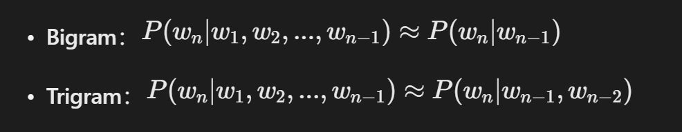
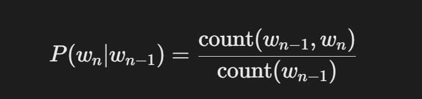
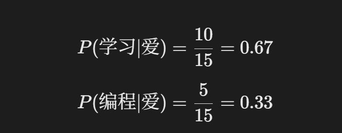

## N-gram

### 基本原理

n-gram算法的基本思想是将文本拆分成若干个连续的n个词的序列，并统计这些序列在文本中出现的频率。这里的n是一个正整数，表示词组中词的个数。

例如，在句子“我喜欢学习自然语言处理”中，

1-gram（unigram）是单个词，如“我”、“喜欢”等；
2-gram（bigram）是相邻的两个词组成的词组，如“我喜欢”、“喜欢学习”等；
3-gram（trigram）则是相邻的三个词组成的词组，如“我喜欢学习”等。
通过统计这些n-gram的频率，我们可以得到文本中各个词组的出现概率分布。这些概率信息对于后续的文本生成、语言模型构建、文本分类等任务具有重要的指导意义。

### N-gram的核心思想：马尔可夫假设

N-gram基于一个重要的简化假设——**马尔可夫假设**：

> 一个词的出现概率只依赖于它前面有限的几个词。

用数学公式表示：

**为什么需要这个假设？**

* 如果不做简化，计算"我愛学习人工智能"的概率需要：

  **P**(**人工智能**∣**我**,**爱**,**学习**)
* 这需要海量数据来估计所有可能的组合，计算上不可行。

### N-gram的概率计算

#### 最大似然估计

#### 实际例子

假设语料库中有：

* "我爱学习" 出现10次
* "我爱编程" 出现5次
* "我爱" 总共出现15次

那么：

