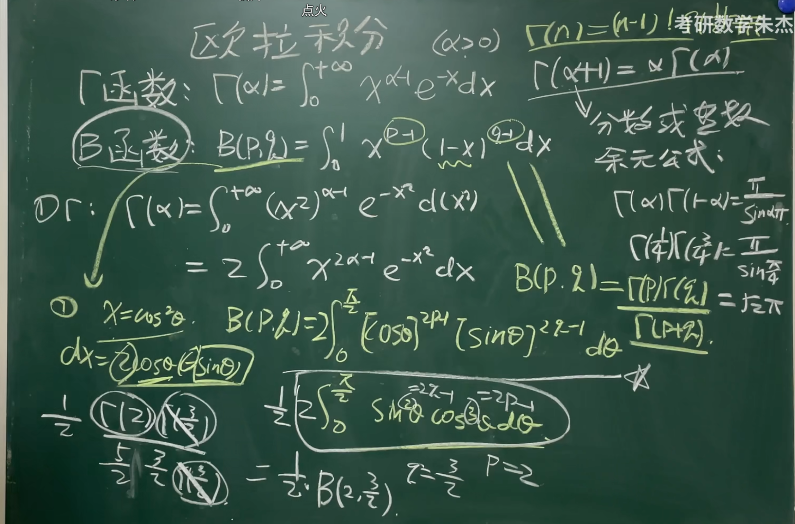
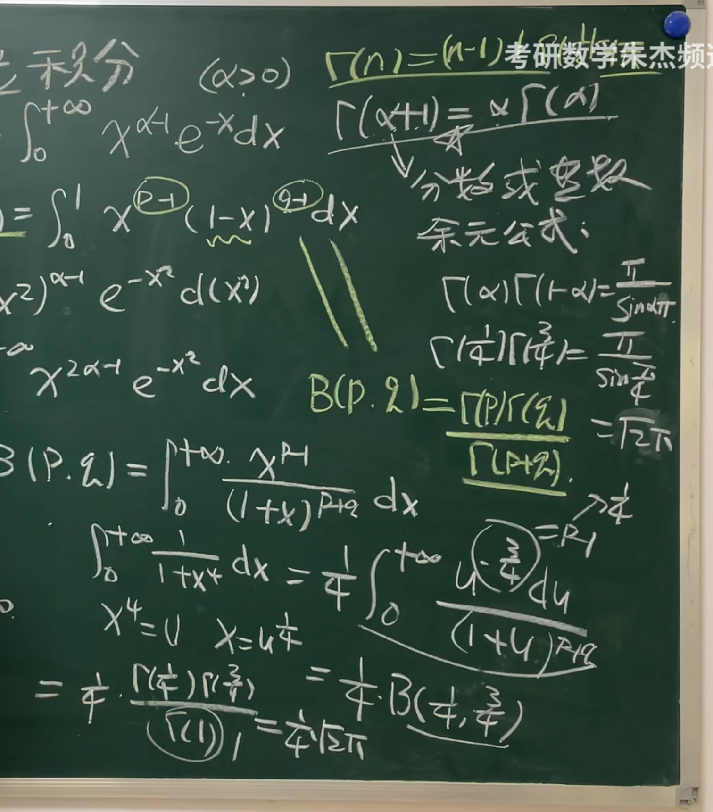
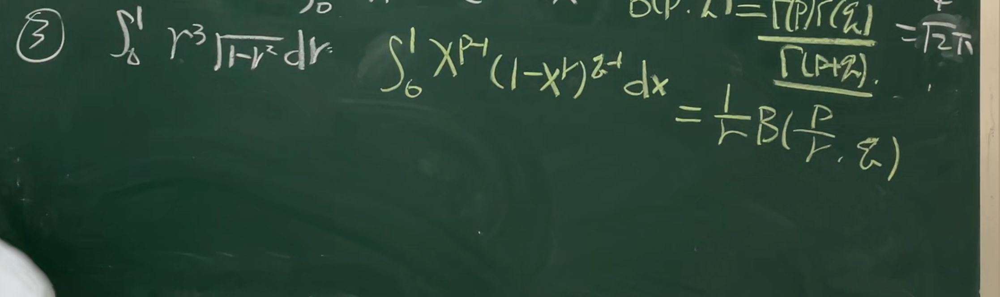
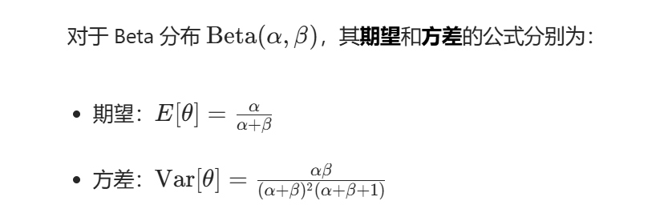
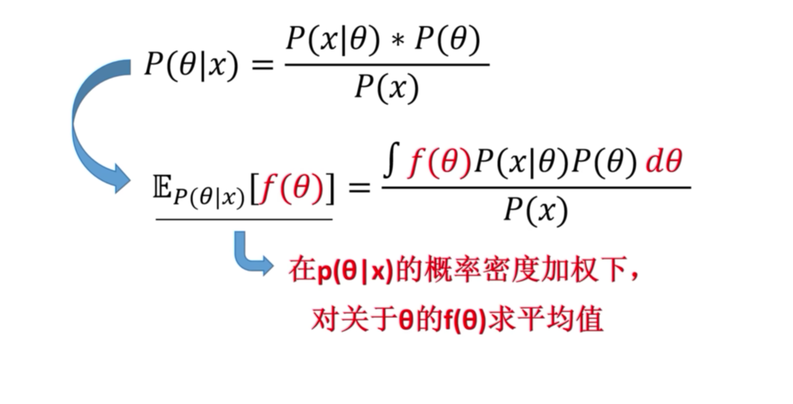
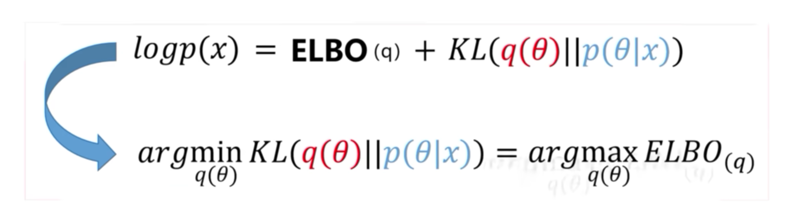
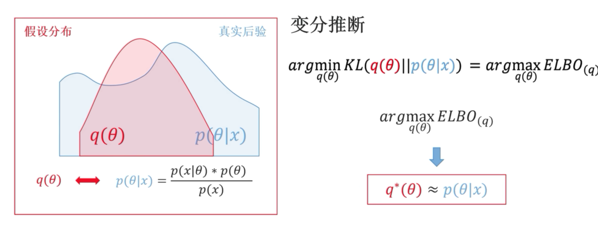
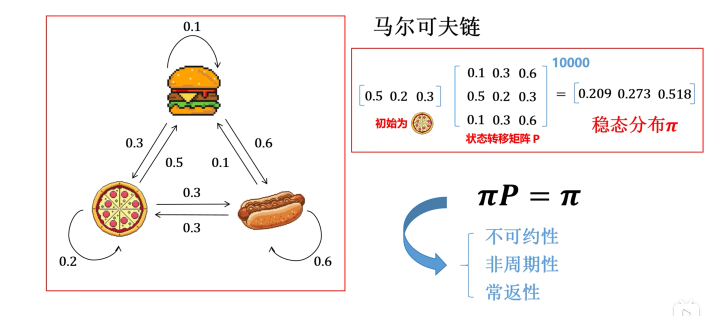
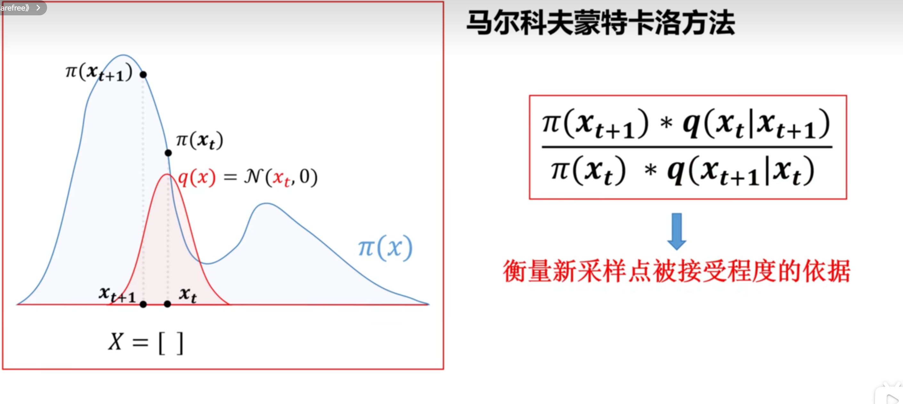

## 欧拉积分

[快速学会“贝塔函数”_哔哩哔哩_bilibili](https://www.bilibili.com/video/BV1UL4y1e7Z4/?spm_id_from=333.337.search-card.all.click&vd_source=8536cb876aa29ebdb0cd5626bc423c0f)

### 基本变形

### 期望与方差

## 变分推断

[什么是变分推断_哔哩哔哩_bilibili](https://www.bilibili.com/video/BV1MnbEzXEnc/?spm_id_from=333.1387.homepage.video_card.click&vd_source=8536cb876aa29ebdb0cd5626bc423c0f)

后验概率公式

最小化KL散度->   最大化证据下界

## 马尔科夫蒙特卡洛方法

### 概率质量

在概率论中，**概率质量（Probability Mass）** 是针对**离散型随机变量**的一个概念，用于描述某个离散状态所对应的概率大小。

#### 1. 与 “概率密度” 的区别

* 对于 **离散型随机变量** （如抛硬币的结果 “正面”“反面”，骰子的点数 1-6），我们用**概率质量**来衡量每个离散状态的概率，记为 **\(P(X = x)\)**，其取值范围是 **\([0,1]\)**，且所有离散状态的概率质量之和为 1，即 **\(\sum_{x} P(X = x) = 1\)**。
* 对于 **连续型随机变量** （如身高、体重），我们用**概率密度**来描述，概率密度函数 **\(f(x)\)** 本身不是概率，需通过积分 **\(\int_{a}^{b} f(x) dx\)** 来计算区间 **\([a,b]\)** 内的概率。

#### 2. 直观理解

可以把 “概率质量” 想象成 “把总概率 1 分配给各个离散状态的‘权重’”。例如，抛一枚公平硬币时，“正面” 的概率质量是 0.5，“反面” 的概率质量也是 0.5，两者之和为 1。

#### 3. 在马尔可夫链中的意义

在之前的细致平衡条件中，“概率质量” 指的是 “某个状态 **x** 所包含的概率总量”。例如，**\(\pi(x) \cdot P(x \to x')\)** 表示 “从状态 **x** 转移到 **\(x'\)** 的概率质量”，而 **\(\pi(x') \cdot P(x' \to x)\)** 表示 “从状态 **\(x'\)** 转移到 **x** 的概率质量”。细致平衡要求这两个方向的概率质量相等，从而保证状态分布的平稳性。

简单来说，概率质量是离散型随机变量中 “单个状态的概率值”，是描述离散概率分布的核心概念之一。

### 马尔科夫链

