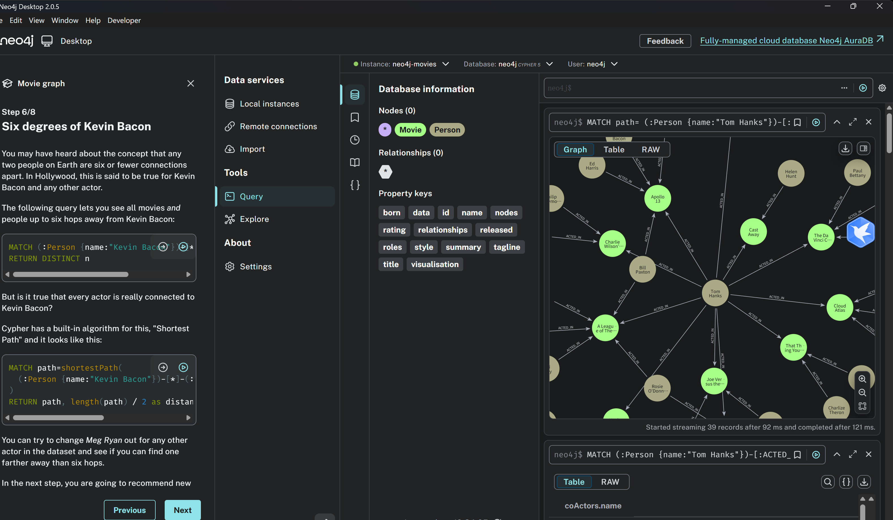
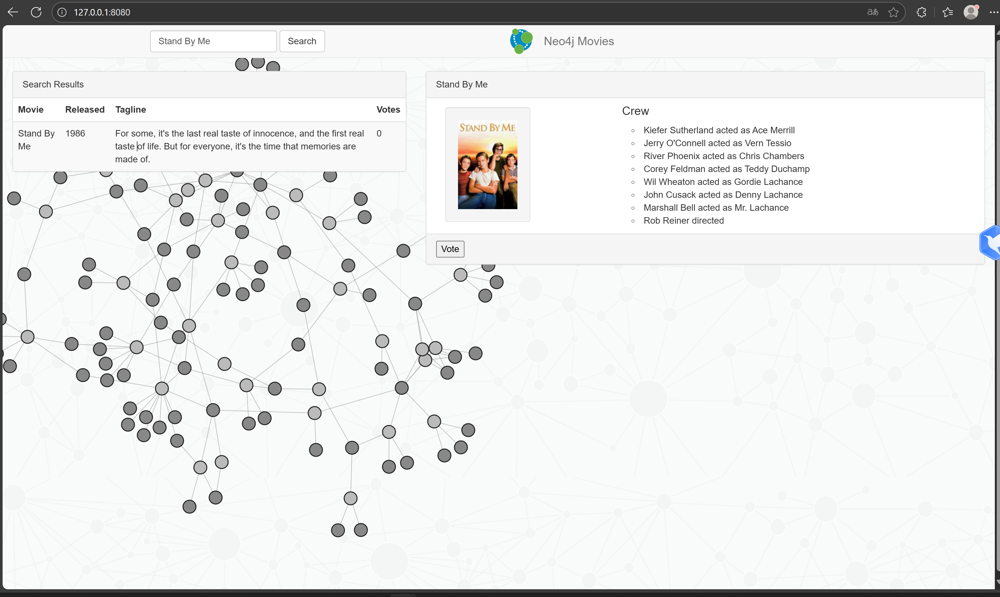
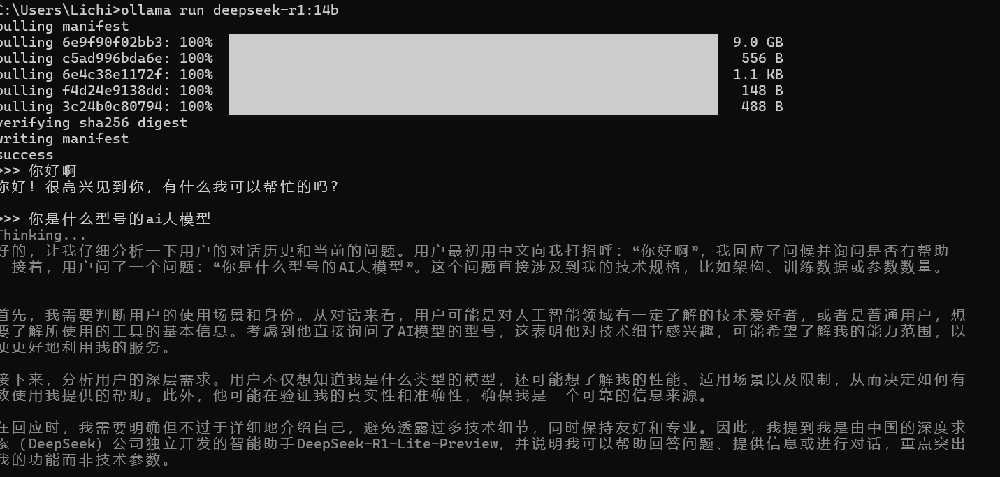

## 知识图谱 neo4j-movies

项目原地址

[neo4j-examples/movies-python-bolt: Neo4j Movies Example application with Flask backend using the neo4j-python-driver](https://github.com/neo4j-examples/movies-python-bolt?tab=readme-ov-file)

neo4j官网

[Neo4j Graph Database &amp; Analytics | Graph Database Management System](https://neo4j.com/)

在本地下载neo4j-desktop

掌握neo4j的连接

cypher的查询

## 通过Ollama在本地部署Deepseek

deepseek-r1:14b

在沉浸式翻译中连接本地模型进行翻译

